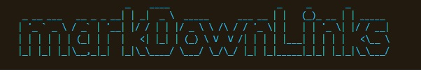
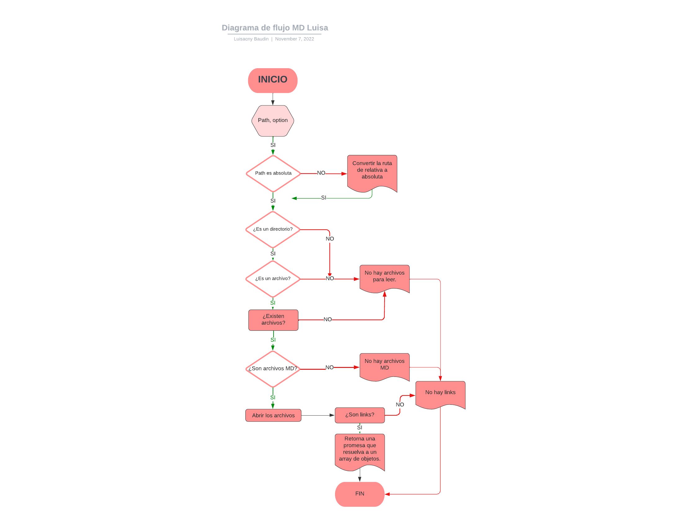
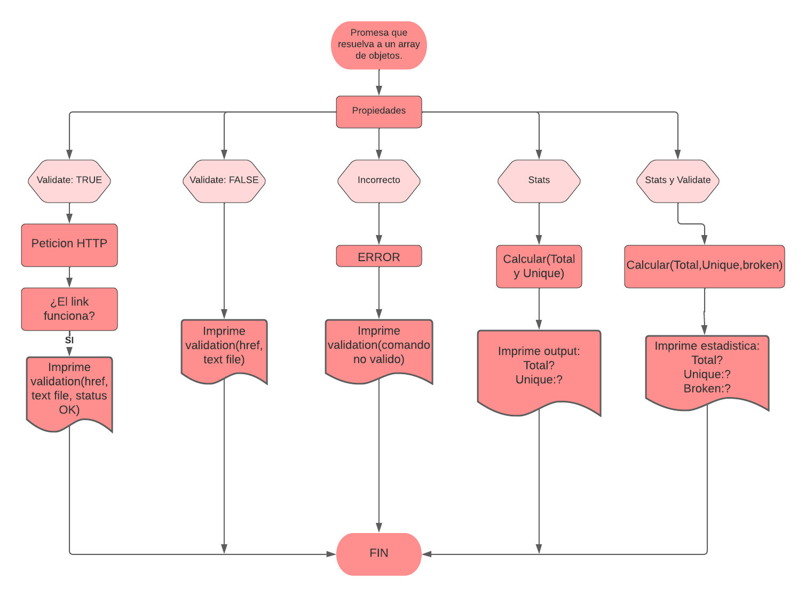

# Markdown Links




## Índice

* [1. Resumen del proyecto](#1-resumen-del-proyecto)
* [2. Diagrama de Flujo. ](#2-diagrama-de-flujo)
* [3. Instalación y guía.](#3-instalacion-y-guia)

***

## 1. Resumen del Proyecto


Esta es una librería que permite extraer y validar links de archivos markdown (.md), en la cual obtendremos los siguientes resultados: 

{Total: #,
Unique: #,
Broken: #;
}

***
## 2. Diagrama de Flujo 






***

## 3. Instalación y guía

---
~~~
npm i luisacnybaudin-md-links
~~~


This is the function you will use:
##### `mdLinks(path, options)`

* `path`: *absolute* or *relative* route to the *file* or *directory*.
* `options`: An object with only this property:
  - `validate`: Boolean that determines if links need to be validated.

It *returns* a `Promise` that is *resolved* with an `Array` of objects, where every `Object` represents a link and contains these properties:

With `validate:false` :
* `href`: URL that was found.
* `text`: Text inside the link (`<a>`).
* `file`: Files's route where the link was found.

With `validate:true` :
* `href`: URL that was found.
* `text`: Text inside the link (`<a>`).
* `file`: Files's route where the link was found.
* `status`: Response HTTP Code.
* `ok`: Message `fail` or `ok` (if it was successful).

Examples (results as comments):
```js
const {mdLinks} = require("luisacnybaudin-md-links");

mdLinks("./some/example.md", { validate: false })
  .then(links => console.log(links)
    // => [{ href, text, file }, ...]
  )
  .catch(console.error);

mdLinks("./some/example.md", { validate: true })
  .then(links => console.log(links)
    // => [{ href, text, file, status, ok }, ...]
  )
  .catch(console.error);

mdLinks("./some/dir", { validate: false })
  .then(links => console.log(links)
    // => [{ href, text, file }, ...]
  )
  .catch(console.error);

mdLinks("./some/dir", { validate: true })
  .then(links => console.log(links)
    // => [{ href, text, file, status, ok }, ...]
  )
  .catch(console.error);
```

### 2.2 CLI

This is the way you can use the executable file by the command line:

`md-links <path-to-file> [options]`

An example:
```sh
$ md-links ./some/example.md
./some/example.md http://something.com/2/3/ Link to something
./some/example.md https://otra-cosa.net/any-doc.html any doc
./some/example.md http://google.com/ Google
```

##### Options

##### `--validate`

An example:
```sh
$ md-links ./some/example.md --validate
./some/example.md http://something.com/2/3/ ok 200 Link to something
./some/example.md https://otra-cosa.net/any-doc.html fail 404 any doc
./some/example.md http://google.com/ ok 301 Google
```

##### `--stats`

An example:
```sh
$ md-links ./some/example.md --stats
Total: 3
Unique: 3
```

Also you can use both `--stats` and `--validate` (it does not matter the order).

Examples:
```sh
$ md-links ./some/example.md --stats --validate
Total: 3
Unique: 3
Broken: 1
```

```sh
$ md-links ./some/example.md --validate --stats
Total: 3
Unique: 3
Broken: 1
```